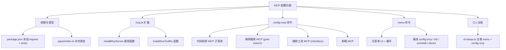
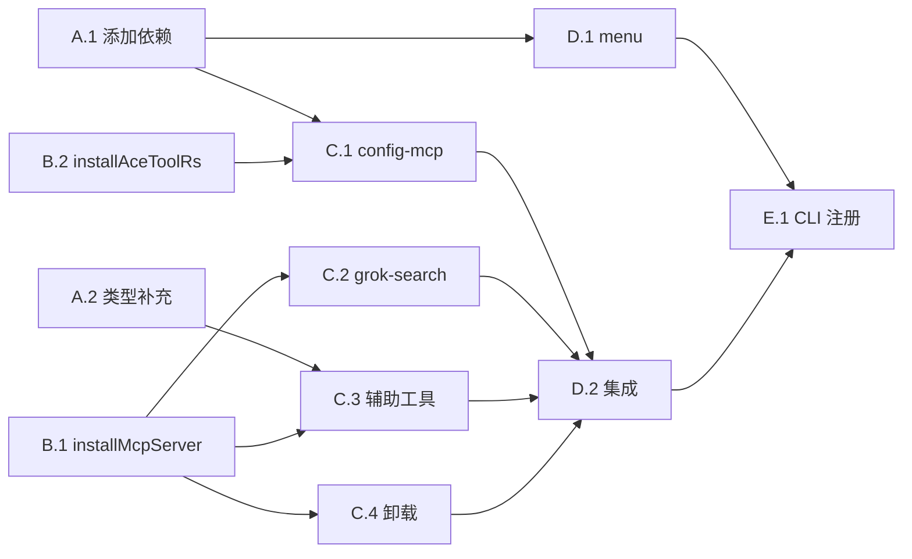

# 功能规划：CXG MCP 配置功能

**规划时间**：2026-03-13
**预估工作量**：14 任务点

---

## 1. 功能概述

### 1.1 目标
为 cxg-workflow 实现交互式 MCP 配置功能，包括 `menu` 主菜单命令和 `config-mcp` 子命令，支持代码检索、联网搜索、辅助工具的 MCP 安装/卸载。

### 1.2 范围
**包含**：
- `menu` 命令：交互式主菜单（含"配置 MCP 工具"入口）
- `config-mcp` 命令：MCP 配置 UI（代码检索 / 联网搜索 / 辅助工具 / 卸载）
- `mcp.ts` 扩展：通用 `installMcpServer` 函数
- 新增依赖：`inquirer`、`ansis`

**不包含**：
- i18n 国际化（cxg-workflow 当前无 i18n 模块）
- API 配置、输出风格配置（不在本次需求范围）
- Windows `cmd /c` 包装（cxg 写入 TOML 格式，Codex CLI 自行处理）

### 1.3 技术约束
- 所有 MCP 配置写入 `~/.codex/config.toml`（TOML 格式，`mcp_servers` key）
- ESM only，TypeScript strict mode
- 保持与现有 cxg-workflow 代码风格一致（无 i18n，中文硬编码）
- 原子写入（tmp + rename）

---

## 2. WBS 任务分解

### 2.1 分解结构图



### 2.2 任务清单

#### 模块 A：依赖与类型（1 任务点）

- [ ] **任务 A.1**：添加运行时依赖（0.5 点）

  **文件**: `package.json`

  **关键步骤**：
  1. `dependencies` 中添加 `"inquirer": "^12.9.6"` 和 `"ansis": "^4.1.0"`

- [ ] **任务 A.2**：补充 TypeScript 类型（0.5 点）

  **文件**: `src/types/index.ts`

  **关键步骤**：
  1. 添加 `AuxiliaryMcpDef` 接口（辅助工具 MCP 定义）：
     ```typescript
     export interface AuxiliaryMcpDef {
       id: string
       name: string
       desc: string
       command: string
       args: string[]
       requiresApiKey?: boolean
       apiKeyEnv?: string
     }
     ```

---

#### 模块 B：mcp.ts 扩展（3 任务点）

**文件**: `src/utils/mcp.ts`

- [ ] **任务 B.1**：添加通用 `installMcpServer` 函数（1 点）

  **输入**：MCP server id、command、args、env
  **输出**：`{ success, message }` 结果
  **关键步骤**：
  1. 读取 `~/.codex/config.toml`（复用已有 `readCodexConfig`）
  2. 确保 `mcp_servers` 表存在
  3. 写入 `mcp_servers.<id> = { type: "stdio", command, args, env? }`
  4. 原子写入（tmp + rename）

  **参考实现**：
  ```typescript
  export async function installMcpServer(
    id: string,
    command: string,
    args: string[],
    env: Record<string, string> = {},
  ): Promise<{ success: boolean, message: string }> {
    try {
      const codexConfig = await readCodexConfig()
      if (!codexConfig.mcp_servers) {
        codexConfig.mcp_servers = {}
      }
      const entry: Record<string, any> = { type: 'stdio', command, args }
      if (Object.keys(env).length > 0) {
        entry.env = env
      }
      codexConfig.mcp_servers[id] = entry
      await writeCodexConfig(codexConfig)
      return { success: true, message: `${id} MCP configured in ~/.codex/config.toml` }
    }
    catch (error) {
      return { success: false, message: `Failed to install ${id}: ${error}` }
    }
  }
  ```

- [ ] **任务 B.2**：添加 `installAceToolRs` 函数（1 点）

  **输入**：`AceToolConfig`（baseUrl?, token?）
  **输出**：`{ success, message }` 结果
  **关键步骤**：
  1. 构建 args: `['ace-tool-rs', '--base-url', baseUrl, '--token', token]`
  2. 写入 `mcp_servers['ace-tool']`（注意 key 仍为 `ace-tool`，与 JS 版一致）
  3. 复用 `readCodexConfig` / `writeCodexConfig`

  **参考实现**：
  ```typescript
  export async function installAceToolRs(config: AceToolConfig): Promise<{ success: boolean, message: string }> {
    try {
      const codexConfig = await readCodexConfig()
      if (!codexConfig.mcp_servers) {
        codexConfig.mcp_servers = {}
      }
      const args = ['ace-tool-rs']
      if (config.baseUrl) args.push('--base-url', config.baseUrl)
      if (config.token) args.push('--token', config.token)
      codexConfig.mcp_servers['ace-tool'] = {
        type: 'stdio',
        command: 'npx',
        args,
        env: { RUST_LOG: 'info' },
      }
      await writeCodexConfig(codexConfig)
      return { success: true, message: 'ace-tool-rs MCP configured in ~/.codex/config.toml' }
    }
    catch (error) {
      return { success: false, message: `Failed to configure ace-tool-rs: ${error}` }
    }
  }
  ```

- [ ] **任务 B.3**：导出调整（1 点）

  **关键步骤**：
  1. 确保 `installMcpServer`、`installAceToolRs`、`installAceTool`、`installContextWeaver`、`uninstallMcpServer` 全部从 `mcp.ts` 导出
  2. 现有 `installAceTool` 和 `installContextWeaver` 无需修改（已写入 `~/.codex/config.toml`）

---

#### 模块 C：config-mcp 命令（5 任务点）

**文件**: `src/commands/config-mcp.ts`（新建）

- [ ] **任务 C.1**：创建 `configMcp` 主入口 + 代码检索子菜单（2 点）

  **输入**：用户交互选择
  **输出**：MCP 配置写入 `~/.codex/config.toml`
  **关键步骤**：
  1. 主菜单：4 个选项（代码检索 / 联网搜索 / 辅助工具 / 卸载）+ 返回
  2. `handleCodeRetrieval()`：ace-tool / ace-tool-rs / ContextWeaver 三选一
  3. `handleInstallAceTool(isRs)`：提示输入 Base URL + Token，调用 `installAceTool` 或 `installAceToolRs`
  4. `handleInstallContextWeaver()`：提示输入硅基流动 API Key，调用 `installContextWeaver`

  **参考**：直接参照 ccg-workflow 的 `config-mcp.ts` 第 12-137 行，将 import 路径改为 `../utils/mcp`，移除 i18n 调用，使用中文硬编码。

- [ ] **任务 C.2**：联网搜索 MCP (grok-search)（1 点）

  **关键步骤**：
  1. `handleGrokSearch()`：提示输入 GROK_API_URL / GROK_API_KEY / TAVILY_API_KEY / FIRECRAWL_API_KEY
  2. 调用 `installMcpServer('grok-search', 'uvx', [...], env)`
  3. 写入搜索提示词到 `~/.codex/rules/cxg-grok-search.md`（参照 ccg 的 `GROK_SEARCH_PROMPT`，但路径改为 `~/.codex/rules/`）

  **注意**：Codex CLI 的 rules 目录为 `~/.codex/rules/`（需确认，如不存在则写入 `~/.codex/prompts/` 或 `~/.codex/.cxg/` 下）

- [ ] **任务 C.3**：辅助工具 MCP（1 点）

  **关键步骤**：
  1. 定义 `AUXILIARY_MCPS` 常量数组（context7 / Playwright / DeepWiki / Exa）
  2. `handleAuxiliary()`：checkbox 多选，逐个安装
  3. 需要 API Key 的（如 Exa）单独提示输入

- [ ] **任务 C.4**：卸载 MCP（1 点）

  **关键步骤**：
  1. `handleUninstall()`：列出所有可卸载的 MCP（ace-tool / ContextWeaver / grok-search + 辅助工具）
  2. checkbox 多选，逐个调用 `uninstallMcpServer(id)`

---

#### 模块 D：menu 命令（3 任务点）

**文件**: `src/commands/menu.ts`（新建）

- [ ] **任务 D.1**：创建简化版主菜单（2 点）

  **输入**：用户交互
  **输出**：路由到各子命令
  **关键步骤**：
  1. `showMainMenu()` 函数，`while(true)` 循环
  2. 显示简化 header（CXG 标题 + 版本号 + 已安装命令数）
  3. 菜单选项：
     - `1. 安装工作流` → 调用 `init()`
     - `2. 配置 MCP 工具` → 调用 `configMcp()`
     - `3. 诊断安装` → 调用 `doctor()`
     - `4. 卸载` → 调用 `uninstall()`
     - `Q. 退出`
  4. 每个操作后 "按回车返回" 暂停

  **参考**：简化版 ccg-workflow 的 `menu.ts`，去掉 ASCII Art Logo、i18n、API 配置、输出风格、Claude 安装等 cxg 不需要的功能。

- [ ] **任务 D.2**：集成现有命令（1 点）

  **关键步骤**：
  1. import `init` from `./init`（需调整 init 使其可在 menu 中无参调用）
  2. import `uninstall` from `./uninstall`
  3. import `doctor` from `./doctor`
  4. import `configMcp` from `./config-mcp`

---

#### 模块 E：CLI 注册（2 任务点）

**文件**: `src/cli-setup.ts`

- [ ] **任务 E.1**：注册 `menu` 命令（1 点）

  **关键步骤**：
  1. 添加 `menu` 命令：`cli.command('menu', 'CXG 交互式菜单')`
  2. 调用 `showMainMenu()`
  3. 将默认命令（空命令）改为显示菜单（而非 help）

  **修改内容**：
  ```typescript
  import { showMainMenu } from './commands/menu'
  import { configMcp } from './commands/config-mcp'

  // Default command -> menu
  cli
    .command('', 'CXG Workflow - Codex 单模型协作工作流')
    .action(async () => {
      await showMainMenu()
    })

  // Menu command (explicit)
  cli
    .command('menu', 'CXG 交互式菜单')
    .alias('m')
    .action(async () => {
      await showMainMenu()
    })

  // Config MCP command
  cli
    .command('config-mcp', '配置 MCP 工具')
    .action(async () => {
      await configMcp()
    })
  ```

- [ ] **任务 E.2**：调整 init 命令默认行为（1 点）

  **文件**: `src/commands/init.ts`

  **关键步骤**：
  1. 使 `init()` 在无参数时使用合理默认值（当前已支持）
  2. 确保从 menu 调用时不会因缺少参数报错

---

## 3. 依赖关系

### 3.1 依赖图



### 3.2 依赖说明

| 任务 | 依赖于 | 原因 |
|------|--------|------|
| C.1 config-mcp | A.1 依赖, B.2 aceToolRs | 需要 inquirer/ansis + mcp 函数 |
| C.2 grok-search | B.1 installMcpServer | 需要通用安装函数 |
| C.3 辅助工具 | A.2 类型, B.1 installMcpServer | 需要类型定义 + 通用安装函数 |
| D.2 集成 | C.1-C.4 | menu 需要调用 config-mcp |
| E.1 CLI 注册 | D.1, D.2 | 需要 menu 和 config-mcp 完成 |

### 3.3 并行任务

以下任务可以并行开发：
- A.1 (依赖) ∥ A.2 (类型) ∥ B.1 (installMcpServer) ∥ B.2 (installAceToolRs)
- C.1 (代码检索) ∥ C.2 (grok-search) ∥ C.3 (辅助工具) ∥ C.4 (卸载)（在 B 完成后）

---

## 4. 实施建议

### 4.1 技术选型

| 需求 | 推荐方案 | 理由 |
|------|----------|------|
| 交互式提示 | inquirer@12 | 与 ccg-workflow 一致，支持 list/checkbox/password/input |
| 终端颜色 | ansis@4 | 轻量、与 ccg-workflow 一致 |
| TOML 读写 | smol-toml（已有） | 已在项目中使用 |

### 4.2 潜在风险

| 风险 | 影响 | 缓解措施 |
|------|------|----------|
| grok-search 的 rules 目录不确定 | 中 | 先写入 `~/.codex/prompts/cxg-grok-search.md`，Codex CLI 会自动加载 prompts 目录 |
| TOML 序列化 env 嵌套表 | 低 | smol-toml 支持嵌套表，但需确认 `mcp_servers.<id>.env` 的序列化格式正确 |
| inquirer@12 ESM 兼容性 | 低 | 项目已是 ESM，inquirer@12 原生支持 ESM |

### 4.3 测试策略

- **手动测试**：`pnpm dev menu` 验证完整交互流程
- **单元测试**：`installMcpServer` / `installAceToolRs` 函数的 TOML 读写逻辑
- **集成测试**：验证写入的 `~/.codex/config.toml` 格式正确，Codex CLI 能识别

---

## 5. 验收标准

- [ ] `npx cxg-workflow` 默认进入交互式菜单
- [ ] `npx cxg-workflow menu` 显示主菜单
- [ ] `npx cxg-workflow config-mcp` 直接进入 MCP 配置
- [ ] 代码检索 MCP：ace-tool / ace-tool-rs / ContextWeaver 三种均可正确安装
- [ ] 联网搜索 MCP：grok-search 可正确安装，搜索提示词写入正确位置
- [ ] 辅助工具 MCP：context7 / Playwright / DeepWiki / Exa 可多选安装
- [ ] 卸载 MCP：可选择性卸载已安装的 MCP
- [ ] 所有 MCP 配置正确写入 `~/.codex/config.toml` 的 `mcp_servers` 表
- [ ] TypeScript 类型检查通过（`pnpm typecheck`）
- [ ] 无高优先级 Bug

---

## 6. 文件变更清单

| 文件 | 操作 | 说明 |
|------|------|------|
| `package.json` | 修改 | 添加 inquirer + ansis 依赖 |
| `src/types/index.ts` | 修改 | 添加 AuxiliaryMcpDef 接口 |
| `src/utils/mcp.ts` | 修改 | 添加 installMcpServer / installAceToolRs |
| `src/commands/config-mcp.ts` | 新建 | MCP 配置 UI（~200 行） |
| `src/commands/menu.ts` | 新建 | 交互式主菜单（~120 行） |
| `src/cli-setup.ts` | 修改 | 注册 menu + config-mcp 命令 |

---

## 7. 后续优化方向（可选）

Phase 2 可考虑的增强：
- i18n 国际化支持
- MCP 健康检查（诊断已安装 MCP 是否可用）
- 自动检测已安装的 MCP 并在菜单中标记状态
- `doctor` 命令集成 MCP 诊断
